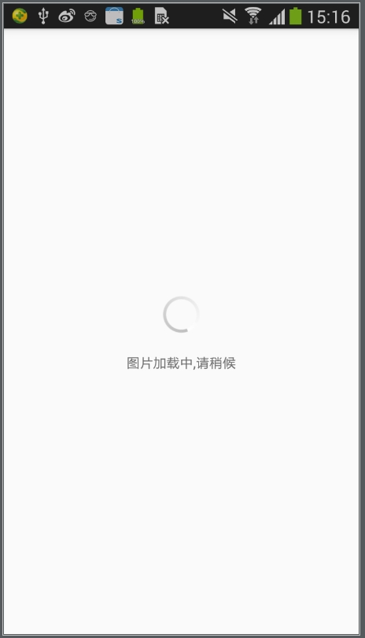
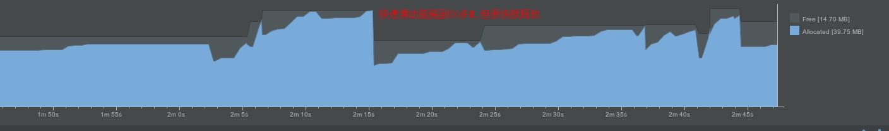
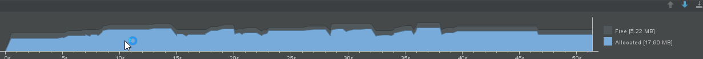

# ImageLoader

图片加载框架的api封装

api设计参考glide,目前底层依赖fresco和glide,可自由切换.如果要用其他图片加载框架,实现ILoader接口即可.
### 更新日志
https://github.com/hss01248/ImageLoader/blob/master/LOG.md

```
public interface ILoader {

    void init(Context context,int cacheSizeInM);//初始化
   
    void request(SingleConfig config);//核心方法
	
	//图片加载的暂停和继续
    void pause();

    void resume();
    
    //下面是操作磁盘缓存的一些方法
    void clearDiskCache();

    void clearCacheByUrl(String url);

    File getFileFromDiskCache(String url);

    boolean  isCached(String url);
    
    //下面是内存的优化-响应app的内存事件,做出相应的处理
    void trimMemory(int level);

    void clearAllMemoryCaches();

}
```
# 初始化

### Application中:

oncreate方法中:

传入全局context和定义缓存文件夹的大小

```
默认底层使用fresco
init(final Context context, int cacheSizeInM)


//useFrescoOrGlide为true时,底层使用fresco,false时使用glide
init( Context context, int cacheSizeInM,boolean useFrescoOrGlide)
    
```

响应app的内存事件,预防OOM:

```

    @Override
    public void onTrimMemory(int level) {
        super.onTrimMemory(level);
        ImageLoader.trimMemory(level);
    }

    @Override
    public void onLowMemory() {
        super.onLowMemory();
        ImageLoader.clearAllMemoryCaches();
    }
    
```


# 入口方法

> 该方法返回SingleConfig.ConfigBuilder

```
ImageLoader.with(this)
```

# 自定义设置

## 几种不同的图片源

```
.url(String url)

.file(String filePath)

.res(int resId)

.content(String contentProvider)
```

## https时是否忽略证书校验

> 默认不忽略

```
.ignoreCertificateVerify(boolean ignoreCertificateVerify)
```

## 传入宽高,用于resize,以节省内存

> 一般,传如用于显示的那个view的宽高就行,单位为dp.内部已自行转换为px
>
> 框架能根据这两个参数去把图片流解压成这个大小的bitmap,可以节约内存空间

```
widthHeight(int width,int height)
```

## 占位图/默认图
> 本方法的生效规则: 
> 当容器view可复用(在recycleview,或者可复用的viewpager中)时,一定会设置占位图,否则会出现两幅实际图片快速切换闪烁的情况
> 当容器view不复用时,当且仅当图片源为网络图片且本地没有缓存时,才会设置placeholder.以避免placehoder和正式图片的快速切换闪烁

```
placeHolder(int placeHolderResId,boolean reuseable)

```

## error图

```
error(int  errorResId)

```

## 圆角矩形

> 可以设置圆角的半径,以及当图片是gif动图时,用什么颜色来盖一层,以实现动图时的圆角

```
rectRoundCorner(int rectRoundRadius,int overlayColorWhenGif)
```

## 设置图片为圆形

```
asCircle(int overlayColorWhenGif)
```

## 图片的边框(glide不支持)
```
border(int borderWidth,int borderColor)
```

## 缩放模式

> 参考fresco的模式设置,取值为ScaleMode.xxx.
>
> 这个模式只会改变bitmap展示在view上面的模式,而不会改变bitmap在内存中的大小

```
scale(int scaleMode)
```

| 类型                                       | 描述                                       |
| ---------------------------------------- | ---------------------------------------- |
| center                                   | 居中，无缩放。                                  |
| centerCrop                               | 保持宽高比缩小或放大，使得两边都大于或等于显示边界，且宽或高契合显示边界。居中显示。 |
| [focusCrop](https://www.fresco-cn.org/docs/scaling.html#focusCrop) | 同centerCrop, 但居中点不是中点，而是指定的某个点。          |
| centerInside                             | 缩放图片使两边都在显示边界内，居中显示。和 `fitCenter` 不同，不会对图片进行放大。如果图尺寸大于显示边界，则保持长宽比缩小图片。 |
| fitCenter                                | 保持宽高比，缩小或者放大，使得图片完全显示在显示边界内，且宽或高契合显示边界。居中显示。 |
| fitStart                                 | 同上。但不居中，和显示边界左上对齐。                       |
| fitEnd                                   | 同fitCenter， 但不居中，和显示边界右下对齐。              |
| fitXY                                    | 不保存宽高比，填充满显示边界。                          |

## 配置高斯模糊

> 传入的参数blurRadius为模糊度,越大就越模糊,实际效果要自己调试好相应的数字

```
blur(int blurRadius)
```

# 最终的出口方法有两个

## 显示到某一个view中

```
into(View targetView)
```

## 或者,只拿bitmap引用

> 此时,scale的配置是无效的,因为没有view去给它展示

```
asBitmap(BitmapListener bitmapListener)
```


# 加载大图

内部采用的是https://github.com/Piasy/BigImageViewer,确实很给力.(注意内部有内存泄漏,尚未解决)
```
ImageLoader.loadBigImage(BigImageView imageView,String path)
//说明: path可以是网络url,文件路径或者content://格式的路径
当是网络url时,注意应该以http开头,这里内部不提供拼接功能
```

如果本地没有缓存,则先显示loading界面,图片下载完后显示图片.

如果本地有缓存,则直接显示图片.

 

## viewpager加载大图的处理

> 用户只需要传入单纯的viewPager应用,框架会替调用者设置好特定的adapter.
>
> pageradapter内部只构建4个BigImageView,滑动时复用此view,则对应的bitmap能够被不断创建和回收.

```
ImageLoader.loadBigImages(ViewPager viewPager, List<String> urls)//urls
```

之前BigImageView有内存泄漏时,.几十张超级大图(4000*3000像素左右),快速滑动和快速缩放时,内存占用偶尔冲上五六十M,但很快会降到40M左右,关掉activity内存一直不下,解决内存泄漏后,十分清爽:

 前一次的activity泄漏:多次进出,基线维持在40M水平

解决了内存泄漏后:20M左右

 


# 内存优化的几个策略的说明

## bitmap编码

将fresco框架默认的RGB_888改成RGB_565,每张图片内存能减小一半,而显示效果相差并不大.

```
初始化时ImagePipelineConfig设置setBitmapsConfig(Bitmap.Config.RGB_565)
```

## downsampling和resization配合

图片向下采样,将图片采样成设定的宽高的bitmap,而不是加载原图.

```
初始化时ImagePipelineConfig.Builder设置setDownsampleEnabled(true)//同时支持PNG，JPG以及WEP格式的图片

每次加载图片时,指定宽高,即可执行resization,将图片解析成该宽高的bitmap.
```

## 预防OOM

参见 [Fresco 5.0以上内存持续增长问题优化](http://blog.csdn.net/honjane/article/details/65629799)

自定义控制fresco的内存对象池大小

```
初始化时ImagePipelineConfig.Builder设置setBitmapMemoryCacheParamsSupplier(new MyBitmapMemoryCacheParamsSupplier(activityManager))
```

并且响应app的内存事件,在内存不够时进行清除内存缓存.

```
Application的回调中调用方法:

@Override
    public void onTrimMemory(int level) {
        super.onTrimMemory(level);
        ImageLoader.trimMemory(level);
    }

    @Override
    public void onLowMemory() {
        super.onLowMemory();
        ImageLoader.clearAllMemoryCaches();
    }
```

## 外部辅助

> 如果图片用的是七牛云存储或者阿里云,那么利用他们的图片处理的api,请求时带上目标宽高等参数,让他们裁剪成你要的小图后返回,不仅省内存,而且省流量.

# 示例代码:

```
ImageLoader.with(this)
        .url("https://pic1.zhimg.com/v2-7868c606d6ddddbdd56f0872e514925c_b.jpg")
        .placeHolder(R.mipmap.ic_launcher)
        .widthHeight(250,150)
        .asCircle(R.color.colorPrimary)
        .into(ivUrl);
        
ImageLoader.with(this)
                .placeHolder(R.mipmap.ic_launcher)
                .res(R.drawable.thegif)
                .widthHeight(250,150)
                .rectRoundCorner(15,R.color.colorPrimary)
                .asBitmap(new SingleConfig.BitmapListener() {
                    @Override
                    public void onSuccess(Bitmap bitmap) {
                        Log.e("bitmap",bitmap.getWidth()+"---height:"+bitmap.getHeight()+"--"+bitmap.toString());
                    }

                    @Override
                    public void onFail() {
                        Log.e("bitmap","fail");

                    }
                });
```


# todo 
1.BigImageView的内存泄漏问题,复用时progressview错乱问题,没有placeholder和error
2. fresco和glide分包引用
   3.glide无法获取到圆角bitmap--transformation包无效果?


# usage

## gradle

**Step 1.** Add the JitPack repository to your build file

Add it in your root build.gradle at the end of repositories:

```
    allprojects {
        repositories {
            ...
            maven { url "https://jitpack.io" }
        }
    }
```

**Step 2.** Add the dependency

```
    dependencies {
            compile 'com.github.hss01248:ImageLoader:0.0.5'
    }
```

# thanks

https://github.com/facebook/fresco

https://github.com/Piasy/BigImageViewer

 [Fresco 5.0以上内存持续增长问题优化](http://blog.csdn.net/honjane/article/details/65629799)

